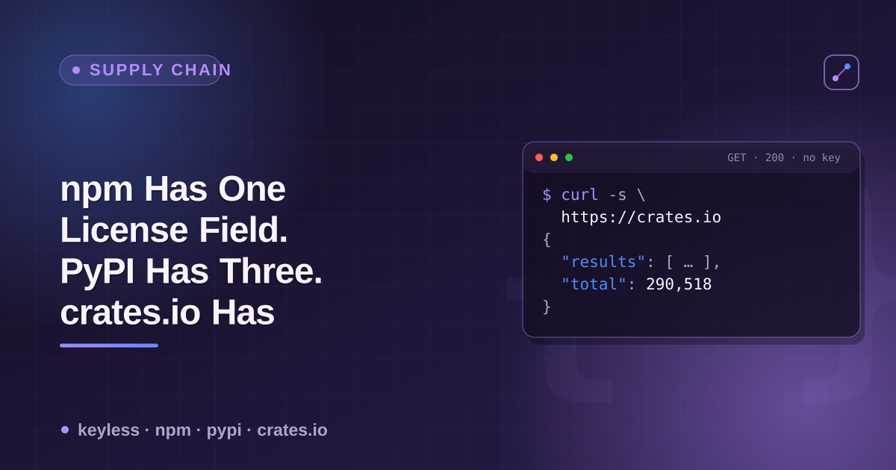

# npm, PyPI & crates.io license data — a cheatsheet



All three major package registries expose package metadata over free, keyless JSON. Only one of them puts the license in one obvious, reliably-populated field. This is the reference for which field to read, on which registry, and what you get when it's empty.

## License fields, by registry

| Registry | Endpoint | Field(s) | What you actually get |
|---|---|---|---|
| npm | `GET https://registry.npmjs.org/{name}/latest` | `license` | A single SPDX-style string (`"MIT"`, `"Apache-2.0"`, `"WTFPL"`). Reliably populated — 8/8 spot-checked packages had it, including deprecated ones. |
| PyPI | `GET https://pypi.org/pypi/{name}/json` | `info.license`, `info.license_expression`, `info.classifiers` (filter `startswith("License")`) | **Three separate fields, none guaranteed.** `license_expression` is the new PEP 639 SPDX field (only populated by recently-updated tooling). `license` is legacy free text — sometimes a name, sometimes the *entire license text* pasted in. Classifiers are the older trove-based approach, now deprecated (PyPI no longer accepts new `License ::` classifiers). |
| crates.io (sparse index) | `GET https://index.crates.io/{path}` | — | **Absent.** Each line is a version record (`name`, `vers`, `deps`, `cksum`, `features`, `yanked`) with no license field. This is the index `cargo` itself fetches when resolving dependencies. |
| crates.io (REST) | `GET https://crates.io/api/v1/crates/{name}` | `crate.license` (or per-version) | The license data does exist here, on the separate REST API the crates.io *website* uses — not the sparse index. |

```bash
# npm — one field, reliably there
curl -s https://registry.npmjs.org/express/latest | python3 -c \
  "import json,sys; print(json.load(sys.stdin)['license'])"
# MIT

# PyPI — check all three, in this priority order
curl -s https://pypi.org/pypi/black/json | python3 -c "
import json, sys
info = json.load(sys.stdin)['info']
expr = info.get('license_expression')
lic = info.get('license')
classifiers = [c for c in info.get('classifiers', []) if c.startswith('License')]
print('license_expression:', expr)
print('license (legacy free text):', (lic[:60] + '...') if lic and len(lic) > 60 else lic)
print('classifiers:', classifiers)
"

# crates.io sparse index — no license field, just version history
curl -s https://index.crates.io/se/rd/serde | tail -1 | python3 -c \
  "import json,sys; d=json.load(sys.stdin); print(sorted(d.keys()))"
# ['cksum', 'deps', 'features', 'links', 'name', 'pubtime', 'vers', 'yanked']  — no 'license'
```

## PyPI's three fields, resolved on 11 real packages (checked live 2026-08-31)

```
package     license               license_expression         classifiers
requests    Apache-2.0            —                           1
flask       —                     BSD-3-Clause                0
numpy       —                     BSD-3-Clause AND 0BSD AND…  0
pandas      <full license text>   —                           1
black       —                     MIT                         0
django      —                     BSD-3-Clause                0
ruff        —                     MIT                         0
polars      <full copyright text> —                           1
hatchling   —                     MIT                         0
uv          —                     MIT OR Apache-2.0           0
fastapi     —                     MIT                         0
```

0/11 have all three populated. 8/11 have only `license_expression` (recently-adopted PEP 639 tooling: setuptools ≥77, Hatchling ≥1.27). 3/11 have no `license_expression` and fall back to `license` — which is a clean SPDX string for `requests`, but the entire license/copyright *text* (not a name) for `pandas` and `polars`, a pattern that comes from old `license = {file = "LICENSE"}` setup configs.

**Read order that covers the most packages:** `license_expression` → `license` (if short, likely a name; if long, it's pasted-in text, not machine-parseable) → `classifiers` filtered to `License ::` prefix, mapped via [PEP 639's classifier→SPDX table](https://peps.python.org/pep-0639/appendix-mapping-classifiers/).

## crates.io: index vs. REST

```bash
# What cargo actually fetches — no license
curl -s https://index.crates.io/re/ge/regex | tail -1 | python3 -c \
  "import json,sys; d=json.load(sys.stdin); print('license' in d)"
# False

# What the crates.io website uses — has license (separate API, separate rate limits,
# requires a descriptive User-Agent per crates.io's API policy)
curl -s -A "your-tool-name (you@example.com)" https://crates.io/api/v1/crates/regex \
  | python3 -c "import json,sys; print(json.load(sys.stdin)['crate']['license'])"
```

Any tool that resolves dependencies via the sparse index (which is what `cargo` itself does, and what most fast Rust-ecosystem tooling uses for speed) will not see a license field at all unless it makes a second, separate call to the REST API per crate. ⚠️ The REST snippet's exact response shape (`crate.license`) is from crates.io's documented API, not live-verified this session — the REST API 403'd from this sandbox, same as the sparse index's absence-of-license was confirmed live but the REST side couldn't be. Verify the shape yourself before scripting against it.

## Cross-registry license check for a dependency list

```bash
check_license() {
  local registry="$1" name="$2"
  case "$registry" in
    npm)
      curl -s "https://registry.npmjs.org/$name/latest" \
        | python3 -c "import json,sys; d=json.load(sys.stdin); print(d.get('license','—'))" 2>/dev/null
      ;;
    pypi)
      curl -s "https://pypi.org/pypi/$name/json" | python3 -c "
import json, sys
info = json.load(sys.stdin).get('info', {})
expr = info.get('license_expression')
lic = info.get('license')
print(expr or (lic[:40] if lic else '—'))
" 2>/dev/null
      ;;
    crates)
      # sparse index has no license — this will always print '—'
      echo "—  (not in sparse index; needs crates.io REST API)"
      ;;
  esac
}

check_license npm express
check_license pypi black
check_license crates serde
```

This is the same normalization my [Package Registry Scraper](https://apify.com/ponderable_hydrometer/package-registry-scraper) actor does across all three registries in one pass — one row per package, one `license` field, source registry tagged. The story behind why I went looking for this in the first place is on dev.to: [npm Has One License Field. PyPI Has Three. crates.io Has Zero.](https://dev.to/ronin13/npm-has-one-license-field-pypi-has-three-cratesio-has-zero)
